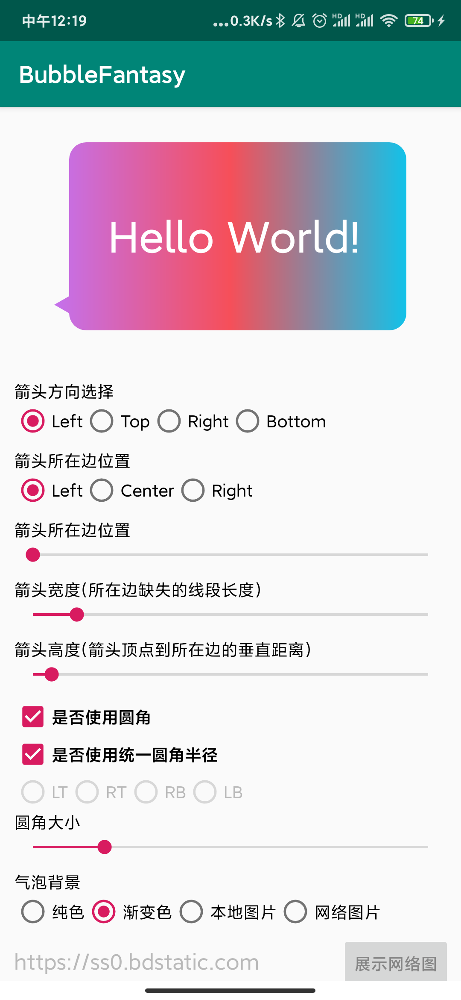

# BubbleFantasy - 自定义气泡控件

## Gradle

```groovy
implementation 'com.yeluo.lib:bubble-fantasy:0.1.0'   //androidx版本
```

## 使用方法
有BubbleTextView，BubbleLinearLayout，BubbleFrameLayout等实现，按需选择
```xml
<com.yeluo.lib.bubble.widget.BubbleRelativeLayout
    android:id="@+id/bubbleLayout"
    android:layout_width="300dp"
    android:layout_height="160dp"
    android:layout_gravity="center"
    android:layout_margin="30dp"
    android:background="#f00"
    android:elevation="10dp"
    android:gravity="center_horizontal"
    app:bf_arrowOffset="30dp"
    app:bf_arrowType="left"
    app:bf_bubbleType="left"
    app:bf_cornerRadius="30dp"
    app:layout_constraintBottom_toBottomOf="parent"
    app:layout_constraintLeft_toLeftOf="parent"
    app:layout_constraintRight_toRightOf="parent"
    app:layout_constraintTop_toTopOf="parent">

    <TextView
        android:id="@+id/tv"
        android:layout_width="match_parent"
        android:layout_height="wrap_content"
        android:layout_centerHorizontal="true"
        android:layout_centerVertical="true"
        android:gravity="center"
        android:text="Hello World!"
        android:textColor="#fff"
        android:textSize="36sp"
        android:textStyle="bold" />

</com.yeluo.lib.bubble.widget.BubbleRelativeLayout>
```

```java
mBubbleLayout.setClipPathCreator(new ClipPathCreator() {
    @Override
    public Path createClipPath(int width, int height) {
        BubblePathBuilder builder = BubblePathBuilder.builder()
            .setBubbleType(mBubbleType)
            .setArrowType(mArrowType)
            .setArrowWidth(mArrowWidth)
            .setArrowHeight(mArrowHeight)
            .setArrowOffset(mArrowOffset + mArrowOffsetMin)
            .setCornerRadius(mCornerRadius)
            .setCornerRadius(mLeftTopCornerRadius, mRightTopCornerRadius, 
                    mRightBottomCornerRadius, mLeftBottomCornerRadius)
            .setBubbleWidth(width)
            .setBubbleHeight(height);
        return builder.create();
    }

    @Override
    public boolean requiresBitmap() {
        return false;
    }
});
```

## 自定义属性
| attr | description | value |
|:---|:---|:---|
| bf_bubbleType | 箭头方位 | left｜right｜top｜bottom |
| bf_arrowType | 箭头位置，箭头在所在边的方向 | left｜right｜center |
| bf_arrowWidth | 箭头宽度，缺失的那一部分的线条的宽度 |  |
| bf_arrowHeight | 箭头高度, 顶点到缺失的那一部分的线条的距离 |  |
| bf_arrowOffset | 箭头偏移量 |  |
| bf_cornerRadius | 气泡圆角 |  |
| bf_ltCornerRadius | 气泡左上角圆角 |  |
| bf_rtCornerRadius | 气泡右上角圆角 |  |
| bf_rbCornerRadius | 气泡右下角圆角 |  |
| bf_lbCornerRadius | 气泡左下角圆角 |  |
| bf_useCornerRadius | 是否设置圆角 | boolean |
| bf_fixPadding | 是否修复内边距 | boolean |
| bf_borderWidth | 描边宽度 |  |
| bf_borderColor | 描边颜色 |  |

## 示例
